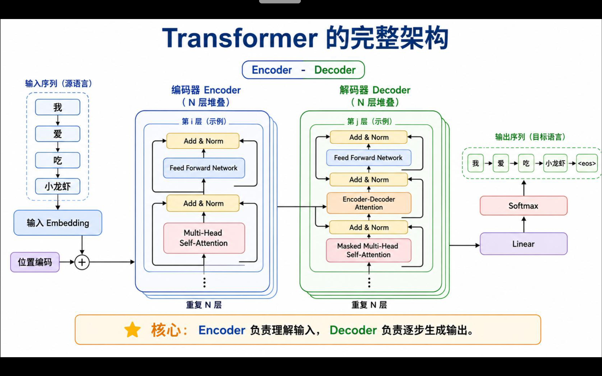

# task-4-answer

- **阅读论文中的 Figure 1，分别找出 Encoder 和 Decoder。参考原图，用自己的方式重新画一张 简化/拓展 的 Transformer 结构图**

	ai画的结构图，画的挺好的就采用了

	

- **重点阅读论文第 3 节，了解 Scaled Dot-Product Attention、Multi-Head Attention、Position-wise Feed-Forward Network 和 Positional Encoding**

	这部分理解在task-4-note.md中

	

- **整理一份阅读笔记，记录你使用了哪些资料或工具、遇到了哪些读不懂的地方、后来怎样理解，以及目前仍然存在哪些疑问**

​       这部分在task-4-reading-note.md中

- **这篇论文最初处理的是什么任务？它为什么尝试不用 RNN 和 CNN？**

	解决机器翻译问题

	RNN 及其变体（LSTM、GRU）是处理序列任务的主流，但它们有一个固有的缺陷：**必须按顺序逐个处理 token**

	这意味着，要计算第 100 个词的状态，必须等前 99 个词都算完，这个“串行”过程从根本上限制了模型在大规模数据上的训练速度，因为无法充分利用 GPU 的并行计算能力

	

- **Self-Attention 中的“Self”是什么意思？它和普通 Attention 有什么区别？**

	“Self-Attention”里的 **“Self”**，核心意思是：**Attention 的 Query、Key、Value 都来自同一个输入序列本身**,也就是说，序列中的每个位置，都在和同一个序列里的其他位置做注意力计算，而不是去关注另一个外部序列

	

- **Q、K、V 分别来自哪里？它们为什么要经过不同的线性变换？**

	embedding把每个Token的编号变成向量
	- Q（Query 查询）：Q = XW_Q
用一个可学习的权重矩阵W_Q，对输入X做线性投影，得到Q。

    - K（Key 键）：K = XW_K
用另一个独立可学习矩阵W_K，同样输入X投影，得到K。

    - V（Value 值）：V = XW_V
第三个独立可学习矩阵W_V，输入X投影，得到V。
 
   Q、K、V的原始素材都是同一个输入X，但是分别乘三组不同的权重矩阵，映射到3个不同的特征子空间
    - Q：代表当前这个token，想要去检索什么信息

	- K：代表所有token身上携带的检索标签

	- V：代表所有token携带的实际内容信息

	

- **Attention 的结果为什么要经过 softmax？得到的每一行权重表示什么？**

	这和分类问题我们提到的问题是一样的，线性回归得到的答案并不是概率，要经过softmax才能转换成概率

	而transformer的最外层就是一层softmax，概率化

	

- **Multi-Head Attention 为什么要分成多个头？多个头只是把同一件事重复多次吗？**

	一个头只能看见一种模式，但不同的关注关系可以同时存在，采用多头可以关注不同的关系

	比如

	- 头 1 关注语法结构
	- 头 2 关注指代关系
	- 头 3 关注局部相邻词
	- 头 4 关注全局语义

	

- **Transformer 没有循环结构，它怎样知道词语的先后顺序？**

	Transformer不知道词序，所一要给每个词贴上标签

	这就要提到**位置编码**

	

	

- **Decoder 中为什么需要 Masked Attention？如果能提前看到后面的答案，会发生什么？**

	生成文本时，模型不能偷看未来的答案

	如果提前看到后面的答案，模型会学会“抄未来”，训练损失很低但推理时完全失效，因为它从未学会真正根据上文预测下文

	

	

- **残差连接、Layer Normalization 和 Feed-Forward Network 分别出现在结构图的哪里？它们大致有什么作用？**

**残差连接**：把子层输入直接加到输出上，避免部分训练效果太差影响整体效果

**LayerNorm**：在残差相加后归一化，稳定每层输入分布

**FFN**：每个位置的独立两层 MLP，引入非线性，提供大部分参数量