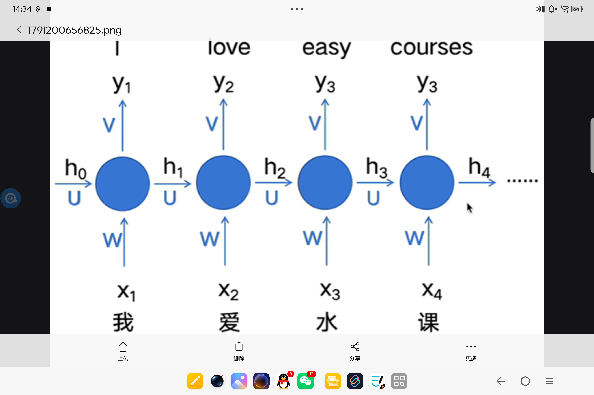
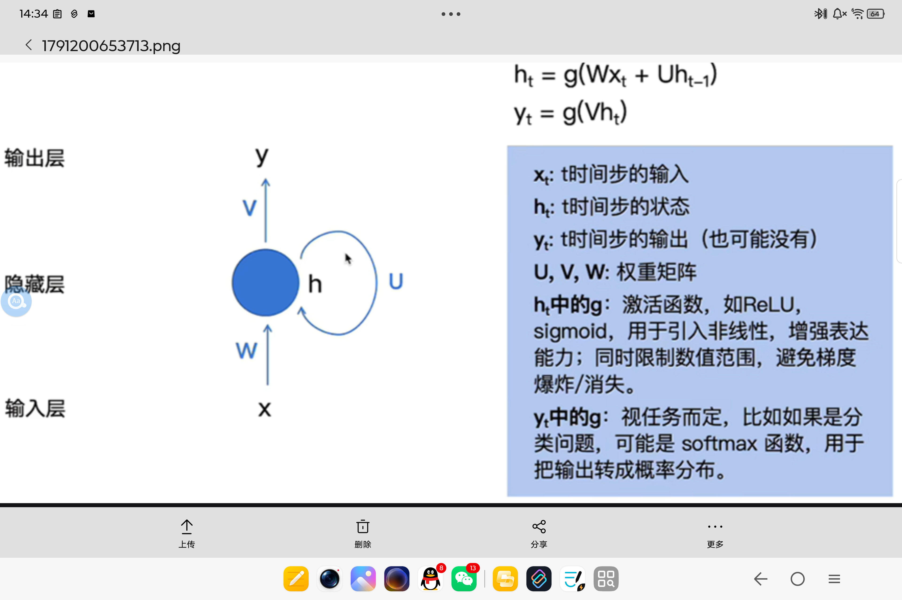
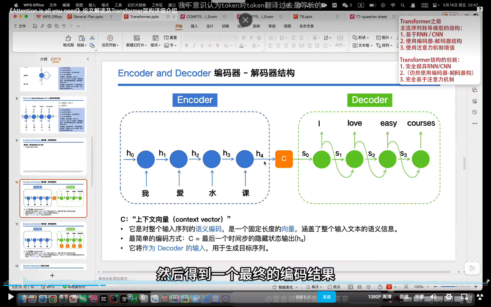
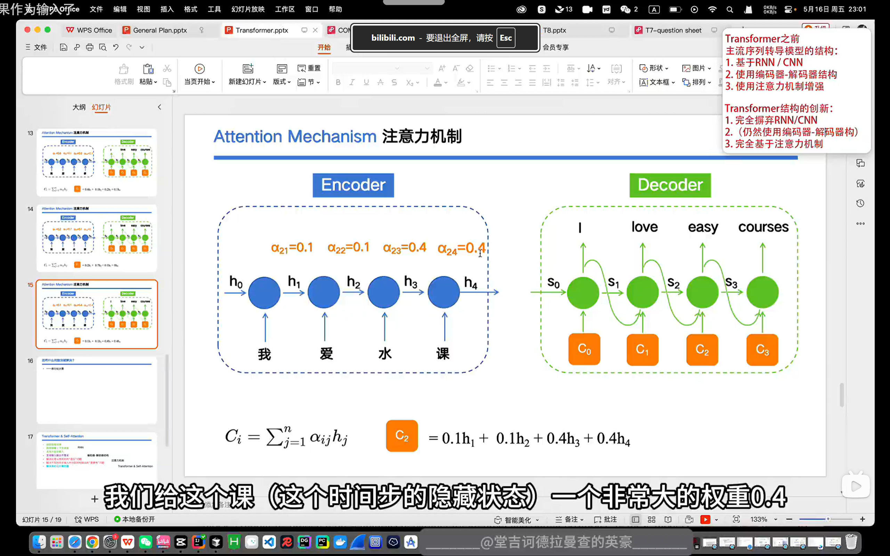

# 这篇笔记专门记录论文阅读的一些疑问
观看学习了b站上讲解论文的视频
## 摘要
### sequence transduction models 序列转导模型
处理序列数据
具有顺序关系的数据
文本翻译，文本生成，语音转文字

前馈神经网络为什么不适合序列转导任务？

固定维度输入 无法理解顺序
而句子长短不一样，拼接之后总向量里数字数量不一样，维度就变了
#### 为解决这个问题，又提出RNN
逐个读单词

但如果输入输出不等长怎么办？

于是提出编码器，解码器

句子太长，信息容易丢失，太慢

#### 注意力机制

#### 自注意力机制
ai解释
1、自注意力（Self-Attention）
 
只有一段句子
句子里的单词，互相看同一句话里别的单词
输入 = 这一段序列；Q、K、V全都来自这一段
自己 ↔ 自己
 
例子： It saw the cat. 
 It  在同一句话里，去找  cat  的关系，只有这一句话
 
2、传统注意力（也叫交叉注意力 Cross-Attention）
 
有两段独立的序列：原序列（源）、目标序列
一边是原文，一边是正在生成的译文
译文里的词（Q），去看原文里面的词（K,V）
A序列 ↔ B序列，两个不一样的东西
 
例子：英文翻译中文
源序列： I love dog 
目标序列（正在生成）： 我 喜欢 
“喜欢”这个词，去看英文句子里的 love 
一边是英文，一边是中文，两个不同序列
自注意力 自己句子内部互看
普通注意力 一个句子去看另一个句子

#### 词嵌入
怎么转换成向量的？
映射高维向量 
训练优化的结果

#### N是啥？
为什么要叠6层？怎么叠？
把一套「自注意力+FFN」的小模块，重复叠6次，一层一层提炼句子信息

#### 位置编码
为什么位置编码这么复杂，不能直接给每个词一个位置编号 1, 2, 3, 4…？
 
这种方案其实是存在的，有的模型（如 BERT）确实就是这么做的
 
但是，这种编码是标量，信息量太少；模型无法理解 “第3个词和第7个词的关系有多远”；尤其是注意力机制是靠向量计算的（比如点积），而单个数字在向量空间里几乎没法建立复杂的关系
 
所以我们要把这个位置变成一个高维向量，这个向量里包含的信息就丰富多了，比如：能让模型感受到不同位置之间的差异；甚至能让模型捕捉到 “某两个词之间的位置差” 等相对关系
#### 三个箭头分别指什么？
Wq  Wk  Wv  三个权重矩阵是通过训练得到的
Q 查询
K 键
V 值
根据上下文信息，让词的高维向量发生偏移
算attention的时候 点积 其实就是在看Q与K的相似程度
#### 多头注意力机制
为什么要用512维？8个头？越多越好么？说是实践得出来的 在性能和计算量中间做了平衡
权重降维 512=64*8
语义子空间
#### 残差连接
去掉“刺头”
#### 归一化
对单个token的向量，重新缩放，让均值≈0，方差≈1
#### 掩码自注意力机制
不能看答案
怎么实现的？
加上上三角掩码：右上角（未来位置）全部填上  -∞
原始分数
[ [2.1, 1.3, 0.5],
  [0.8, 3.2, 1.1],
  [0.4, 0.9, 2.6] ]

加上掩码（右上角换成负无穷）
[ [2.1, -∞, -∞],
  [0.8, 3.2, -∞],
  [0.4, 0.9, 2.6] ]
#### 最后线性层是怎么把向量转换为英文单词的？
映射到词表上，打分，softmax转换概率

